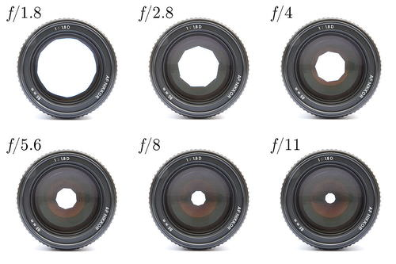
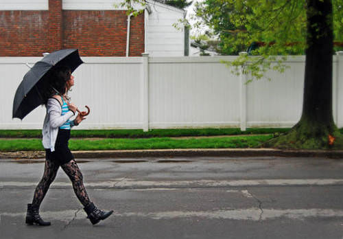
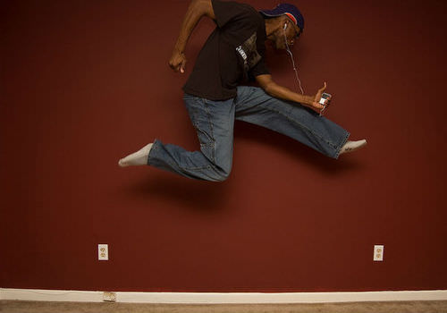
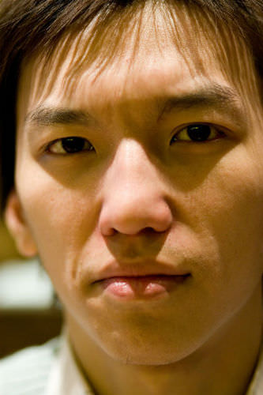

<!--
author:   Stephen Politzer

email:    LiaScript@web.de

version:  0.0.1

language: en

narrator: US English Female

comment:  Whether you just got a digital camera (or smart phone), are new to photography, or have a little experience, this course is for you. Each chapter will provide you with information, examples, opportunities to develop your skills, and time to reflect on what you've learned. Instead of a traditional end-of-course final, you'll be guided in the development of a digital photo portfolio to demonstrate your skills.

logo:     ../cover.jpg

tags:      photography

-->

# Digital Imaging 1: Digital Photography Basics

> This document was automatically translated to LiaScript from
>
> https://flexbooks.ck12.org/user:378bc6da0230/cbook/digital-imaging-1:-digital-photography-basics/section/1.1/primary/lesson/digital-photography-basics-course-introduction/

## 1.1 Digital Photography Basics Course Introduction

<article>

\[Figure 1\]---

  
Do you...

* Have a digital camera or smartphone?
* Shoot photos?
* Share photos with family, friends or the world?

Do you want to...

* Learn the basics of digital photography?
* Shoot better photos?

This course is for you!

The lessons in this course are designed to help you master the basics of digital photography. Complete them carefully and thoughtfully. Take the time to review your work critically, and reflect on what you are learning. You can even do the lessons multiple times to practice the photo composition concepts.

In each lesson (after the Introduction), you’ll have opportunities to shoot digital photo series that demonstrate the concepts you're learning. Many lessons have links to Internet resources where you can learn more. It's important to use these resources. They'll give you more details and examples to help you understand the concepts.

You’ll also be responding in writing whenever you see RECORD YOUR FINDINGS. Don’t simply write the information directly from the words in the lessons. While it’s okay to use the vocabulary words you're learning, it’s important for you to be able to describe the concepts in your own words. In addition, when an activity contains an online resource, some information from that resource MUST be included in your response to show that you've learned from the resource.

During the course, you’ll create a collection of your photos. You can download and keep them on a computer, flash drive, online in Google Drive or Dropbox, or online at an image/photo-sharing site like Flickr, Picasa, SnapFish, or PhotoBucket. It’s important to organize them by topic, so you can easily find the photos you need to assemble your digital photo portfolio at the end of the course.

Unless otherwise noted, images used in this course are licensed through Creative Commons and are available at Flickr (http://www.flickr.com/creativecommons/). For complete information on Creative Commons licensing, see[CreativeCommons.org](http://creativecommons.org/licenses/).

Some of the images used in this course have been edited to have the appearance needed to learn and practice the course concepts.

Cover photos: "Self Portrait" (Paul Wolfenden; https://www.flickr.com/photos/joeshlabotnik/6916248255/) edited into"thetechdog" (taken by the course author).

### Chapter Summary

**Chapter 1: Digital Photo Basics Course Introduction**

**Chapter 2: Your Digital Camera**

* Open the Box
* Shutter Speed & Aperture
* Auto, Semi-Manual, & Manual Shooting Modes
* Special Scene Modes
* Resolution & Compression

**Chapter 3: Basic Photo Composition**

* Steady Camera
* Rule of Thirds
* Level Horizon
* Fill the Frame
* Distracting Backgrounds

**Chapter 4: Direction & Movement**

* Direction of Movement
* Framing
* Point of View
* Leading Lines
* Freezing Movement

**Chapter 5: Light and Shadow**

* Quality of Light
* Direction of Light
* Silhoettes
* Light & Shadow

**Chapter 5: Flash**

* Flash Modes
* Flash & Distance
* Flash Glare
* Fill Flash

**Course Final: Digital Photography Portfolio**

</article>

## 2.1 Introduction

<article>

In this chapter, you'll learn the first set of photo composition basics.Each is important on its own and in combination with each other. Don't rush through the chapter. Take the time to learn from the directions, images, and additional online resources. Then, apply what you've learned to improve your photo composition. Learn and work thoughtfully, so you'll be ready to share your photos to your teacher and explain how they show what you've learned.

#### Summary

* Steady Camera
* Rule of Thirds
* Level Horizon
* Fill the Frame
* Distracting Backgrounds

</article>

## 2.2 Open the Box

<article>

---

This lesson will help you get started with your digital camera when you**OPEN THE BOX.**As you work through the topics, you'll get explanations and photos to build understanding. You'll also find additional online resources to learn more. It's important to review and learn from these resources! At the end ofa topic you may find a section calledRECORD YOUR FINDINGS. When you answer the questions, be sure to include information you learned from the additional online resources.

---

****  
WHAT IS A JPEG?**  
**JPEG stands for Joint Photographic Experts Group and is the most common format for digital photos. A JPEG can display millions of colors, so it's perfect for photos. There are other image formats that also display millions of colors, but JPEGs are compressed to create smaller image files while still looking good. Compression allows you to save more photos in less space. You'll learn more about compression - good and bad - later in this chapter. File format extensions most commonly associated with JPEG photos are _.jpeg_ and _.jpg_.

RECORD YOUR FINDINGS

* What are two main reasons the JPEG format is used for digital photos?  
    

---

**BATTERY**  
Digital cameras require batteries to function. Most use rechargeable batteries. However, some use rechargeable battery packs or regular replaceable batteries.

RECORD YOUR FINDINGS

* What kind of battery/batteries does your digital camera use?
* Is there any marking or tab that helps you know how to put the battery/batteries back in the camera? If so, what?  
    

---

**MEMORY CARD**  
Most digital cameras store images on a removable memory card. Common digital camera memory card formats include SD (Secure Digital), MS (Memory Stick), xD (Extended Digital), and CF (Compact Flash). Memory cards come in different capacities, measured from small to large: MB (megabytes) to GB (gigabytes). The larger the capacity, the more images the card will store.

, the "x" suffix following a speed number, and class rating - but the easiest to understand, and most commonly used, is class rating. A class 10 card has a minimum data transfer rate of 10 MBPS while a class 2 card has a minimum data transfer rate of 2 MBPS. Don't worry about what MBPS actually means, just know that 10 is a lot faster than 2. This is important. If you are shooting large, high quality photos or high definition video, as many up-to-date digital cameras can do, you should go for a higher class with more speed. Check your digital camera's user manual for memory card speed requirements. You'll also learn more about image size and quality in the third lesson in this chapter, Resolution and Compression.")

Learn more about digital camera memory card types at Camera memory cards explained from Photo Technique:  
http://www.phototechnique.com/kit/camera-memory-cards-explained/

Learn even more about memory cards, including how many photos you can take depending on the photo size and card capacity at 10 Things To Know About Digital Camera Memory Cards from MakeUseOf:  
http://www.makeuseof.com/tag/digital-camera-memory-cards/

Locate your digital camera’s memory card compartment, and remove the card. Take care to note any directional markings or icons (little picture symbols) that will help you know how to put the memory card back into the camera.

RECORD YOUR FINDINGS

* What type of memory card does your digital camera use?
* What is the capacity of your memory card?
* If your memory card has a speed rating, what is it?  
    

---

**ON/OFF**  
Make sure your battery is charged and in your digital camera - and you've inserted the memory card. Now, locate your camera's On/Off button/switch, and turn on the camera.  

---

**DATE & TIME SETTINGS**  
Digital cameras code images with the date/time they are taken. When you turn on your camera for the first time, you’ll be prompted to set the date/time. If you haven’t set the date/time and have been using your camera, you can still set them by going in to the camera’s menu and finding the settings.

Locate and press the menu button on your digital camera. Then, find Settings. The name “Settings” may be different for your camera. In Settings, find an open the options for setting/changing the date/time. Make sure the date/time are set correctly.

RECORD YOUR FINDINGS

* How do you get to the date/time settings for your camera?  
    

---

**CLEANING YOUR CAMERA LENS**  
If your camera lens is dirty, it’s like shooting photos through a dirty window. So, before you start, be sure your camera lens is clean. However, DON’T start wiping off the dirt, as this can scratch the lens and give you worse images than just having a dirty lens. Also, DON’T spray the lens with compressed air, as this can force dirt and dust inside the lens housing.

How do you clean a camera lens? \[1. Carefully, blow away any grit or dust, or brush it away with a camel’s hair brush made for camera lenses. \[2. Gently wipe the lens surface with a clean, soft, lint-free cloth, like a microfiber cloth for cleaning eyeglasses. \[3. If needed, use a little lens cleaning fluid (or, in a pinch, water) applied to the cloth. \[4. Consider buying a lens-cleaning tool that has a brush on one end and a lens pen on the other end (about $8).

Learn more about cleaning camera lenses at About.com:  
http://cameras.about.com/od/tutorials/a/How-To-Clean-A-Camera-Lens.htm

RECORD YOUR FINDINGS

* Describe the steps for cleaning a camera lens.
* Describe what not to do when cleaning a camera lens.  
    

---

**PHOTO PREVIEW, PLAYBACK & DELETE**  
Digital cameras have LCD (liquid crystal display) screens. The LCD screens are used for previewing images as you shoot. Another use for the LCD screens – and one advantage of digital photography – is that after shooting a photo, you can see it right away instead of taking in film for processing and waiting for the photos to be developed. Your digital camera has a button to switch between camera and playback mode. Often the button is marked with a triangle icon, like the Play button on a DVD or BlueRay player. Locate your camera's playback button.

One more thing before you start shooting photos... Most digital cameras have an auto-focus mode for ease of use. When you shoot a photo, try pressing the shutter button halfway to allow the camera to automatically focus the image. Once the image is focused, press the shutter button the rest of the way to shoot the photo.

Now, shoot some photos. Don’t worry about the elements of good photo composition. You’ll learn about these in the chapters to come. For now, just get to know your digital camera and have some fun.

After you shoot some photos, switch to playback mode and view your photos. Select a photo you don’t want, and delete it.

RECORD YOUR FINDINGS

* Draw a picture of the icon for the playback button.
* Draw a picture of the icon for the delete function.
* What are the advantages of digital image capture over film photography discussed in this section?  
    

---

**SHARE YOUR PHOTOS  
**Photos are stored as JPG images on your digital camera’s memory card, but there will be times when you will want to share photos with other people - like your teacher. There are several ways to share your photos.

One way to share your photos is by downloading them to a computer and copying them to a portable flash drive. When you download photos from your camera to a computer, you are actually copying them from one location to another. The original remains on the memory card, and a copy is created on your computer.

Some digital cameras connect directly to a computer with a USB cable. Others are placed in a camera dock that stays connected to the computer with a USB cable. More often, though, you’ll use a memory card reader. A memory card reader is a small device which connects to the computer with a USB cable. The card reader has slots which fit one or more types of memory cards. When you insert a memory card in the card reader slot, the computer can access the files on the memory card. The card appears as another drive on the computer desktop (Macintosh) or My Computer/Computer (Windows). Double click on the drive icon to open it. The image files will be in a folder called DCIM. When you open this folder, you can copy image files onto your computer just as you would copy any other files. This is great for backing up important images or organizing them into collections.

Some digital cameras come with software for downloading and organizing images. There are also programs available like iPhoto (Mac) or Picasa (Mac and Win).

Another way to share your photos is through social media. Smart phones, and even some new digital cameras, connect to the Internet via WiFi. With these devices, you can upload photos directly to social media sites like Facebook or Google+.

However you download or share your photos, as you go through this course, you'll need to be able to show them to your teacher. You'll also need to use them in the course final project - Your Digital Portfolio.

  
RECORD YOUR FINDINGS

* How do you download photos from your digital camera?
* What is the function of a memory card reader?
* Other than downloading photos, what's another way to share your photos?

</article>

## 2.3 Shutter Speed & Aperture

<article>

---

This lesson will help you understand **SHUTTER SPEED & APERTURE**and how these two are related. Start with the explanations in GET THE BASICS to build understanding. Then, deepen your learning with additional online resources in EXPLORE. The additional online resources are essential to understanding shutter speed & aperture! When you respond to the questions and prompts in RECORD YOUR FINDINGS, be sure to include information you learned from the additional online resources.

---

**GET THE BASICS  
**Shutter speed and aperture are two of three basic elements of photography, often referred to as the exposure triangle. The third is ISO, a measure of how sensitive your camera's sensor is to light. The term ISO comes from film photography. Film has ISO ratings that indicate sensitivity to light. The lower the ISO, the less sensitivity. The higher the ISO, the greater the sensitivity. Digital cameras don't use film, but some digital cameras have ISO settings that simulate film ISO ratings. For this basic course, you're going to concentrate on shutter speed and aperture.

Shutter speed is just that – how quickly the camera’s shutter opens and then closes when shooting a photo. The longer the shutter is open, the more light it lets in, which is better for low light settings. However, longer shutter speeds can cause images to be blurry from accidentally moving the camera. Shorter shutter speeds are good for capturing things that are moving. Be careful, though. Shorter shutter speeds decrease the amount of light entering the lens and work better in bright light settings.

Aperture is the opening in a camera lens that can be made bigger of smaller to let more or less light through the lens. Aperture is measured in f-stops.

**  
EXPLORE  
**Learn about shutter speed at Introduction to Shutter Speed in Digital Photography from Digital Photography School:  
http://digital-photography-school.com/shutter-speed/

Learn about aperture and depth of field at_Understanding Your Camera: Lens Aperture Demystified_from Martin Pot – Photography Blog: http://martybugs.net/blog/blog.cgi/learning/Lens-Aperture-Demystified.html

Look at photo examples of depth of field at _Meaning of Depth of Field_ from Second Picture:  
http://www.secondpicture.com/tutorials/photography/meaning_of_depth_of_field.html

  
**RECORD YOUR FINDINGS**

* When would you use a slower shutter speed?
* When would you use a faster shutter speed?
* Describe the resulting depth of field when using a wide-open aperture.
* Describe the resulting depth of field when using a small aperture.

</article>

## 2.4 Auto, Semi-Manual, & Manual Shooting Modes

<article>

---

This lesson will help you understand AUTO, SEMI-MANUAL, & MANUAL SHOOTING MODES.Start with the explanations in GET THE BASICS to build understanding. Then, deepen your learning with additional online resources in EXPLORE. The additional online resources are essential to understanding shooting modes! When you respond to the questions and prompts in RECORD YOUR FINDINGS, be sure to include information you learned from the additional online resources.

---

  
GET THE BASICS  
Your digital camera has auto, semi-manual, and manual shooting modes that relate to shutter speed and aperture - and who/what is setting them. Auto mode is the simplest to use. In auto mode, all you do is point and shoot, or point, hold the shutter button down halfway to use auto-focus, and shoot. The digital camera senses which shutter speed and aperture provide the optimum exposure. Some digital cameras have more than one auto mode, such as Program Auto and Intelligent Auto. Program Auto is the basic auto mode to get the optimum exposure. Intelligent Auto tries to understand your intention with the photo and adjust accordingly. For example, it may recognize a moving subject and try to freeze it, or it may see the warm colors of a sunset and try to bring out those colors. The image below shows an example of a digital camera mode selections dial. You'll learn more about the little picture icons (scene modes) in the next lesson.

, to indicate shutter priority on the dial or menu selections. Aperture priority does just the opposite of shutter priority. Aperture priority allows you to set the aperture value to control depth of field and lets the digital camera attempt to find a shutter speed that works with your aperture setting. Many experienced photographers use a light meter to help them determine appropriate aperture values. The majority of digital cameras use "A", while some use "AV" (aperture value), to indicate aperture priority on the dial or menu selections.")

Manual mode allows you to set both the shutter speed and aperture value. In manual mode, YOU have to determine all of your motion and depth of field needs and requires a lot of experience. Again, many experienced photographers use a light meter to help them determine appropriate aperture values.

  
EXPLORE  
Learn about shutter and aperture priority modes at Aperture and Shutter Priority Modes from Digital Photography School:  
http://digital-photography-school.com/aperture-and-shutter-priority-modes/

Learn about shutter and aperture priority modes at Which mode is better? Aperture priority of shutter priority from Digital Photo Secrets:  
http://www.digital-photo-secrets.com/tip/1330/which-mode-is-better-aperture-priority-or-shutter-priority/

  
RECORD YOUR FINDINGS

* Describe the differences between auto, shutter, aperture, and manual shooting modes.
* Which mode do you think you'd use most often and why? (There's no right or wrong answer for this one.)

</article>

## 2.5 Special Scene Modes

<article>

---

This lesson will help you understand SPECIAL SCENE MODES.Start with the explanations in GET THE BASICS to build understanding. Then, deepen your learning with additional online resources in EXPLORE. The additional online resources are essential to understanding scene modes! When you respond to the questions and prompts in RECORD YOUR FINDINGS, be sure to include information you learned from the additional online resources.

---

  
GET THE BASICS  
Most digital cameras have special scene modes that control the camera's settings specific situations. In the previous lesson, you learned about shooting modes that allow you to set the shutter speed and/or aperture. Scene modes are basically presets for shutter speed, aperture, and other factors, like optimizing colors.Common scene modes include Portrait, Landscape, Night, Sports. Depending on your digital camera, you may have fewer - or many more - scene modes.

Here are two examples of scene modes:

_Portrait scene mode_ assumes that you want the subject to be in focus and the background out of focus. So, the aperture is automatically set to be larger (smaller _f_ stop) to create a narrow depth of field. The camera also finds a shutter speed that is compatible with the larger aperture.

Scene modes are usually represented by little icons (pictures) that indicate visually what each scene mode does.Some digital cameras have help menus that describe the functions of each scene mode. These descriptions can help you to learn more about each.

Locate the scene mode settings for your digital camera. Can you recognize the purpose of each based on the icons?

  
EXPLORE  
Learn about scene mode settings at _Guide to Digital Camera Shooting Modes_ fromSnapFish: http://www.snapfish.com/snapfish/digitalcameramodes/

Learn more about scene modes at _Common Digital Camera Scene Modes_ from Picture Perfect:  
http://www.picturecorrect.com/tips/digital-camera-scene-modes/

  
RECORD YOUR FINDINGS

* Name and describe five or more of your digital camera’s shooting/scene mode settings. Include drawings of the icons representing each.

</article>

## 2.6 Resolution & Compression

<article>

---

This lesson will help you understand **RESOLUTION & COMPRESSION**and how these two are related. Start with the explanations in GET THE BASICS to build understanding. Then, deepen your learning with additional online resources in EXPLORE. The additional online resources are essential to understanding shutter speed & aperture! When you respond to the questions and prompts in RECORD YOUR FINDINGS, be sure to include information you learned from the additional online resources.

---

**GET THE BASICS  
**There are two main factors that contribute to the file size and quality of a digital photo: resolution and compression.

**Resolution** is a measure of the number of pixels (dots) used to make a photo. Think of this as a picture you make with tiny dots of color. If you look at the picture with a magnifying glass, you can see the dots, but when you back away and look at the picture from a distance, the dots disappear and the picture emerges.

. To calculate photo size in megapixels, multiply the photo's pixel width by the pixel height and divide by one million. In the diagram below, the green photo has a resolution of 0.3 MP (640 x 480 = 307,200÷ 1,000,000 = 0.3072). The black photo has four times the width and height and a resolution of 5 MP (2560 x 1920 = 4,915,920÷ 1,000,000 = 4.9152). That's 16 times the number of pixels, and it's hard to find a digital camera on the market that has fewer than 12 MP.")

You can adjust your digital camera's resolution when shooting photos.The determining factor for how many MP to use is how the photos will be used. Printers can handle higher MP counts and with 8 MP, your printed photos will be clear and sharp (unless you're trying to print large posters).To be honest, the maximum number of megapixels you'll probably need for printing is 8 MP.

Screen display is totally different. Computer screens don't act like printers. Photos you'll use for presentations or web display can have lower resolutions and still look fine. And, since the resolutions are smaller, the file sizes of the photos are smaller and load faster over the Internet. For screen display, you'll need to experiment with different MP settings, but probably won't need anything larger than 1-2 MP.

Learn more about pixel resolution at Geek.com:  
http://www.geek.com/digital-camera-buyers-guide/megapixels/

**  
Compression** is a function of how much information is kept or discarded to make an photo file smaller when storing it. Photos can have millions of colors. The JPEG compression process attempts to compare colors of pixels that are near each other and determine if a color is actually needed. If not, that color is discarded. If sufficient numbers of colors are discarded, there's less information to store and the file size is reduced (compressed). The more compression, the smaller the file size. The downside of compression is that removing colors lowers photo quality. If you apply too much compression, the photo doesn't look as good.

Different digital cameras use different terms for compression. Some use size terms like large, medium, and small to describe the file sizes resulting from compression. A large photo would have little or no compression, while a small photo would be highly compressed. Other digital cameras use quality terms like high, medium, and low. A high quality photo would have little or no compression, while a low quality photo would be highly compressed. Still others use percentages of quality like 100% for uncompressed and lower percentages for more compression. For example, a photo with a quality of 60% would be 40% compressed. Here's sample of the effects of compression:

Learn more about digital photo (JPEG) compression at _JPEG Compression_ from the Sheridian Group:  
http://learnmem.cshlp.org/site/misc/tsg_JPEG_instructions.pdf

\[Optional\] For more than you’ll ever need to know about compression, check out _Everything You Need To Know About Image Compression_ from Noupe.com:  
http://www.noupe.com/design/everything-you-need-to-know-about-image-compression.html

  
Most digital cameras have settings for resolution and compression. In combination, these determine the size of digital photo files. Setting your camera to use higher resolution and less compression can result in better photos for printing but, because the file sizes are larger, will decrease the number of photos your memory card will hold. Setting your camera to use moderate or lower resolution and more compression will result in photos that will display well on a computer screen but may appear pixelated (blocky) when printed. However, since these photo file sizes are smaller, the number of photos your memory card will hold will increase.

Locate the resolution and compression menu options for your digital camera. (1) One way of thinking is to set the combination that reflects how you will be using your photos: printing or screen display. (2)Another way of thinking is to use no compression when shooting photos to get the best quality possible. Then, if you need to compress to decrease file size, you can edit the photos with a program like PhotoShop or Pixlr Editor (see_Digital Imaging 2: Editing Images_on CK-12) for LOTS more about editing photos). If you don't have access to edit your photos - or don't want to edit them - go with option 1 above. If you want choices after shooting photos, go with option 2 above.

  
RECORD YOUR FINDINGS

* Describe resolution in your own words.
* Describe compression in your own words.
* How do you set the resolution and compression options for your digital camera?
* Set your digital camera’s resolution to its highest setting. View your screen display and record how many photos you can take at this setting. Then, set your digital camera’s resolution to its lowest setting. Record how many photos you can take at this setting.
* Which resolution/compression options are better for printing and which are better for screen display?

</article>

## 3.1 Introduction

<article>

In this chapter, you'll learn the first set of photo composition basics.Each is important on its own and in combination with each other. Don't rush through the chapter. Take the time to learn from the directions, images,and additional online resources. Then, apply what you've learned to improve your photo composition. Learn and work thoughtfully, so you'll be ready to share your photos to your teacher and explain how they show what you've learned.

#### Chapter Summary

* Steady Camera
* Rule of Thirds
* Level Horizon
* Fill the Frame
* Distracting Backgrounds

</article>

## 3.2 Steady Camera

<article>

---

This lesson will help you learn and practice**STEADY CAMERA.**In GET THE BASICS, you'll get explanations and photos to build understanding. In EXPLORE, you'll find additional online resources to learn more. It's important to review and learn from these resources also! You'll have opportunities to practice in BUILD YOUR SKILLS. Finally, answer the questions in RECORD YOUR FINDINGS at the end of this topic, be sure to include information you learned from the Explore resources.

---

  
**GET THE BASICS**  
There are many things to learn about taking good photos. The first and most important of these is keeping the camera steady. A steady camera captures clear and sharp photos. Moving the camera makes the photos blurry and is one of the most common mistake beginners make. So how can you keep the camera steady?

One way to keep the camera steady is to use a tripod. A tripod is a stand with three legs. Many photographers also use a monopod. Like it sounds, a monopod is a stand with only one leg. Tripods and monopods allow you to hold the camera on something solid, so it's easier to keep the camera steady.

****

**\[Figure 5\]**

**  
EXPLORE  
**Before shooting your own steady camera photos, learn more about steadying your camera at_Eliminating Camera Movement_from Short Courses:  
http://www.shortcourses.com/use/using2-1.html

Also look at_More ways to hold a camera steady when a tripod isn’t possible_:  
http://www.digitalcameraworld.com/2012/07/25/more-ways-to-hold-a-camera-steady-when-a-tripod-isnt-possible/

For even more information on how to steady your camera, including pictures of hand placement, see_Sharp Pictures with Your Digital Camera, Part 1: Camera Shake_from Ritz Interactive. You’ll even learn how to hold a cell phone camera steady:  
http://www.ritzcamera.com/static/articles/tips/nyip2006a.html  

**  
BUILD YOUR SKILLS  
**Shoot four or more pairs of photos. For each pair, choose a subject. For the first photo in a pair, try a steady camera technique. Press the shutter button smoothly halfway down to let your camera auto focus. Then press smoothly the rest of the way. Taking your time is better than rushing and jiggling the camera.For the second photo in the pair, try shooting without using a steady camera technique.

Compare your steady/not-steady photo pairs.Share your photo pairs with your teacher, and be prepared to discuss how they show what you’ve learned. Download your photos to a computer to keep them for the portfolio you’ll create in the end-of-course final project.

  
**RECORD YOUR FINDINGS**

* Why is the skill of Steady Camera important?
* How do the Steady Camera 1 and 2 photo pairs compare? Are the photos without steadying the camera as clear and sharp as the Steady Camera 1 and 2 photos?
* What are four things you can do to steady the camera?

</article>

## 3.3 Rule of Thirds

<article>

---

This lesson will help you learn and practice**RULE OF THIRDS.**In GET THE BASICS, you'll get explanations and photos to build understanding. In EXPLORE, you'll find additional online resources to learn more. It's important to review and learn from these resources also! You'll have opportunities to practice in BUILD YOUR SKILLS. Finally, answer the questions in RECORD YOUR FINDINGS at the end of this topic, be sure to include information you learned from the Explore resources.

---

**  
GET THE BASICS**  
Beginners point-and-shoot with their point-and-shoot digital cameras – usually with the subjects right in the middle of the photos. One of the first rules of photo composition is the rule of thirds. Using this rule, the subject is NOT in the middle. Here’s how it works: In your mind, divide the photo area into thirds with two equally-spaced horizontal and vertical lines.

\[Figure 1. Place the most important part of your photo at one of the four intersections. This creates a photo that is balanced, interesting, and pleasing to the eye.

Many digital cameras have a setting which overlays a rule of thirds grid on the screen. This can be very helpful as you practice your rule of thirds photocomposition. See if your digital camera has this setting.

  
**EXPLORE  
**Before shooting your own rule of thirds photos, learn more about the rule of thirds at Photoble:  
http://www.photoble.com/photography-tips-tricks/composition-101-rule-of-thirds-in-photography-with-examples

Learn more with annotated examples at _Rule of Thirds_ from Photography Mad:  
[http://www.photographymad.com/pages/view/rule-of-thirds](http://www.photographymad.com/pages/view/rule-of-thirds%20)

Finally, see the rule of thirds applied to amazing photos at _Superb Rule-of-Thirds Photography_ from Abduzeedo:  
http://abduzeedo.com/superb-rule-thirds-photography  

  
**BUILD YOUR SKILLS**  
Shoot four or more pairs of photos. For the first photo in each pair, place the subject in the center of the photo. For the second photo in each pair, apply the rule of thirds by placing the subject on one of the four intersections. Try different subjects, like a tree, a person, or a pet.

Compare your centered/rule of thirds photo pairs. Select FOUR pairs. Share your photo pairs with your teacher, and be prepared to discuss how they show what you’ve learned.Download your photos to a computer to keep them for the portfolio you’ll create in the end-of-course final project.

  
**RECORD YOUR FINDINGS**

* What is the rule of thirds?
* Why is the rule of thirds important?
* Describe how you applied the rule of thirds in each of the four photo pairs you selected?

</article>

## 3.4 Level Horizon

<article>

---

This lesson will help you learn and practice **LEVEL HORIZON****.**In GET THE BASICS, you'll get explanations and photos to build understanding. In EXPLORE, you'll find additional online resources to learn more. It's important to review and learn from these resources also! You'll have opportunities to practice in BUILD YOUR SKILLS. Finally, answer the questions in RECORD YOUR FINDINGS at the end of this topic, be sure to include information you learned from the Explore resources.

---

**  
GET THE BASICS  
**When you look at a landscape, you’re used to seeing a level horizon. Even with your head tilted, your brain still registers the horizon as being level. It's just the way our brains are wired. The horizon should be horizontal (horizon – horizontal – get it?) This is true indoor as well. Floors and ceilings should be horizontal. When you see a photo with a tilted horizon, it doesn't look right.

Another thing to keep in mind with the horizon is the rule of thirds. You’ll want to place the level horizon one-third from the bottom of the photo if you want more sky or one-third from the top if you want more land or water. Here are examples of each.

Level horizon with 1/3 land and 2/3 sky:

**EXPLORE**  
Before shooting your own level horizon photos, learn more about why you need a level horizon at _Photography Lesson - The Importance of Straight Horizons_from About:  
http://photography.about.com/od/takingpictures/qt/Photography-Lesson-The-Importance-Of-Straight-Horizons.htm

Get some quick tips at _Getting Horizons Horizontal_from Digital Photography School:  
http://digital-photography-school.com/getting-horizons-horizontal/

Now, learn more level horizon techniques at _4 ways to insure a level horizon_from Digital Camera World:  
http://www.digitalcameraworld.com/2012/03/30/4-ways-to-ensure-a-level-horizon/

  
**BUILD YOUR SKILLS  
**Shoot four or more pairs of photos. For the first photo in each pair, let the horizon tilt. For the second photo in each pair, concentrate on keeping a level horizon. Choose a variety of subjects: landscape with some sky, sky with some landscape, sky-horizon like a sunset or sunrise, and indoor with the floor or ceiling line showing.

Compare your level horizon photo pairs. Select FOUR pairs. Share your photo pairs with your teacher, and be prepared to discuss how they show what you’ve learned.Download your photos to a computer to keep them for the portfolio you’ll create in the end-of-course final project.

  
**RECORD YOUR FINDINGS**

* What is a level horizon?
* Why is a level horizon important?
* How does the rule of thirds apply to a level horizon?
* How did you insure a level horizon in each of the four pairs you selected?

</article>

## 3.5 Fill the Frame

<article>

---

This lesson will help you learn and practice**FILL THE FRAME.**In GET THE BASICS, you'll get explanations and photos to build understanding. In EXPLORE, you'll find additional online resources to learn more. It's important to review and learn from these resources also! You'll have opportunities to practice in BUILD YOUR SKILLS. Finally, answer the questions in RECORD YOUR FINDINGS at the end of this topic, be sure to include information you learned from the Explore resources.

---

  
**GET THE BASICS**  
You shoot photos something you want to see. That something is called the subject of the photo. If the subject is actually only a small part of the photo, it can get lost. To make the subject the most important thing, move close enough so that it fills the digital camera screen. This is the concept of filling the frame.

Here is an example of a photo with three boys. They are the subject of the photo. In the photo on the left, see how motorcycle pulls your eyes away from the subject? This happens in the middle photo as well. How about the photo on the right? Now, the boys are the most important. This is clear, because they fill the frame of the photo.

Be careful though. If you get so close that your digital camera can’t focus, the photo will be blurry. Always press the shutter button half way to let the camera auto-focus. If it can’t, you’ll know that you’re too close.

Another way to get close is to use your digital camera’s zoom. However, it’s important to know the difference between optical zoom and digital zoom. Optical zoom moves the camera lens farther from the image sensor, magnifying the image that reaches the sensor without decreasing the resolution (number of pixels) or image quality. Digital zoom shoots a cropped view of the image and then enlarges it to fill the frame. It does this by making the pixels larger. This can result in a blurry, blocky appearance, because you see that actual pixels. This is refered to as pixelated. If you use digital zoom, shoot at a high resolution. Otherwise, it can result in pixelated photos like the one on the right below.

**EXPLORE**  
Before shooting your own fill the frame photos, learn more about why it's important to fill the frame at _Fill the Frame in Your Photography Composition_from PictureCorrect:  
http://www.picturecorrect.com/tips/fill-the-frame-photography-composition/

Learn more with great fill the frame examples at _Fill Your Frame_from Digital Photography School:  
http://digital-photography-school.com/fill-your-frame/

To help you understand the difference between optical and digital zoom, check out _What Is The Difference Between Optical Zoom and Digital Zoom? Which is Better?_from tfpsoft's Digital Camera Guide:  
http://www.tfpsoft.com/fun/digitalcameraguide/digitalversusopticalzoom.html

  
**BUILD YOUR SKILLS**  
Shoot four or more pairs of photos. For the first photo in each pair, make the subject a small part of the photo. For the second photo in each pair, apply the concept of fill the frame. In at least one pair of photos, fill the frame by physically moving closer to the subject. In at least one other pair of photos, fill the frame by using your camera's zoom (optical and/or digital).

Compare your fill the frame photo pairs. Select FOUR pairs. Share your photo pairs with your teacher, and be prepared to discuss how they show what you’ve learned.Download your photos to a computer to keep them for the portfolio you’ll create in the end-of-course final project.

  
**RECORD YOUR FINDINGS**

* What is the importance of filling the frame?
* How can filling the frame change the purpose of the photo?
* What are two things you can do to fill the frame?
* How are optical zoom and digital zoom different?

</article>

## 3.6 Distracting Backgrounds

<article>

---

This lesson will help you learn and practice avoiding**DISTRACTING BACKGROUNDS.**In GET THE BASICS, you'll get explanations and photos to build understanding. In EXPLORE, you'll find additional online resources to learn more. It's important to review and learn from these resources also! You'll have opportunities to practice in BUILD YOUR SKILLS. Finally, answer the questions in RECORD YOUR FINDINGS at the end of this topic, be sure to include information you learned from the Explore resources.

---

  
**GET THE BASICS**  
Often, you concentrate so much on the subject of a photo, you forget the background - the area around and behind the subject. The background can complement, or distract from, the photo. If the background is busy, or a tree branch appears to grow out of your subject’s head, the result isn’t going to be a good photo.

One way to clear up a distracting background is to zoom in on the subject. This creates less area around the subject to distract the eye. In this example, the bleachers, pole, and trees distract the eye from focusing on the subject, the people. The matching photo corrects this by zooming in.

**EXPLORE**  
Check out more about distracting backgrounds at_Five Ways Backgrounds Make or Break Photos_from the Digital Photography School:  
http://www.digital-photography-school.com/5-ways-backgrounds-make-or-break-photos

So far you've learned two ways to fix distracting backgrounds. Now, learn more ways to fix distracting backgrounds at _9 Tips for Getting Backgrounds Right_fromthe Digital Photography School:  
http://digital-photography-school.com/getting-backgrounds-right/

  
**BUILD YOUR SKILLS  
**Shoot four or more pairs of photos. For the first photo in each pair, keep a distracting background. For the second photo in each pair, apply one of the methods you've learned to fix the distracting background. In at least one pair of photos, fix the distracting background by zooming in. In at least one other pair of photos, fix it by changing the direction you use to shoot the photo.

Compare your distracting background photo pairs. Select FOUR pairs. Share your photo pairs with your teacher, and be prepared to discuss how they show what you’ve learned.Download your photos to a computer to keep them for the portfolio you’ll create in the end-of-course final project.

  
**RECORD YOUR FINDINGS**

* How can a distracting background hurt a photo?
* What are some things that can make an photo’s background distracting?
* Describe three or more ways to correct a distracting background.

</article>

## 4.1 Introduction

<article>

In the previous chapter, you learned photo composition basics. In this chapter, you'll learn about movement and direction in your photos. People move. Trees and cars move. Life moves.Life is a continuous series of movements that surround us.A photo, on the other hand, doesn't move. A photo captures a moment or object as a still image. So, an important concept in photography is creating the appearance of movement... the appearance of life. You can create paths into and through your photos. You can also change the direction you use to shoot photos to show the world from different directions and points of view.

Again, don't rush through the chapter. Take the time to learn from the directions, images, and additional online resources. Then, apply what you've learned to improve your photo composition. Learn and work thoughtfully, so you'll be ready to share your photos to your teacher and explain how they show what you've learned.

#### Chapter Summary

* Direction of Movement
* Framing
* Point of View
* Leading Lines
* Freezing Action

</article>

## 4.2 Direction of Movement

<article>

---

This lesson will help you learn and practice**DIRECTION OF MOVEMENT.**In GET THE BASICS, you'll get explanations and photos to build understanding. In EXPLORE, you'll find additional online resources to learn more. It's important to review and learn from these resources also! You'll have opportunities to practice in BUILD YOUR SKILLS. Finally, answer the questions in RECORD YOUR FINDINGS at the end of this topic, be sure to include information you learned from the Explore resources.

---

**  
GET THE BASICS  
**Direction of movement is the feeling that a photo's subject is moving across the photo. It is created by allowing space in front of the subject for the subject to move into. In the photo on the left below, the dog is centered. There is an equal amount of space in front of and behind the dog. Your eye is drawn equally in front of and behind the dog, so the dog appears to be still. In the photo on the right, the space in front of the dog is greater than the space behind the dog. This greater space is called leading space. Your eye is drawn to the leading space making it appear that the dog is walking into that space. The photo on the right is an example of direction of movement.

1. The woman appears to be walking from right to left into the leading space.

2. The bicycle racer appears to be moving from right to left into the leading space.

**EXPLORE  
**Before shooting your own direction of movement photos, here's a quick look at direction of movement, what it is and why it works, at _Leave Space For Movement_ from Outdoor Photographer:  
http://www.outdoorphotographer.com/how-to/tip-of-the-week/leave-space-for-movement.html

Then, check these examples and explanations from _Project 6: direction of movement_ at Susan Barwood's OCA Photography blog:  
http://susanbarwoodphotography.blogspot.com/2011/05/project-6-direction-of-movement.html

**BUILD YOUR SKILLS**  
Shoot four or more pairs of photos. For the first photo in each pair, center the subject. For the second photo in each pair, apply the concept of direction of movement by leaving leading space in front of the subject.

Compare your direction of movement photo pairs. Select FOUR pairs. Share your photo pairs with your teacher, and be prepared to discuss how they show what you’ve learned.Download your photos to a computer to keep them for the portfolio you’ll create in the end-of-course final project.

  
**RECORD YOUR FINDINGS**

* What is leading space?
* How does leading space create direction of movement?
* Describe what you did with your photos to create direction of movement.

</article>

## 4.3 Framing

<article>

---

This lesson will help you learn and practice**FRAMING.**In GET THE BASICS, you'll get explanations and photos to build understanding. In EXPLORE, you'll find additional online resources to learn more. It's important to review and learn from these resources also! You'll have opportunities to practice in BUILD YOUR SKILLS. Finally, answer the questions in RECORD YOUR FINDINGS at the end of this topic, be sure to include information you learned from the Explore resources.

---

**GET THE BASICS**Just like a picture frame can surround a photo, in photography, framing is a technique using something in the foreground that “frames” the subject, leads the eye into the photo to focus on the subject.It also gives a feeling of depth because the subject is further away than the frame. Here are some examples of framing.

1. The shadow of the arch in the front frames the building in the distance.

2. Here's a similar photo with an old stone building forming the frame.

3. You can frame the subject in a doorway.

4. Even trees can serve as a frame.

\[Figure 4. Notice that you can use a variety of things for frames, like an interesting arch, tree branches, doorframes, and even a crumbling building. Can you think of other frames?

**EXPLORE**Before shooting your own framing photos, learn more about framing at _Guidelines for Better Photographic Composition: Framing_ from Photoinf.com:  
[http://photoinf.com/General/KODAK/guidelines\_for\_better\_photographic\_composition\_framing.html](http://photoinf.com/General/KODAK/guidelines_for_better_photographic_composition_framing.html)

Get ideas for framing with LOTS of examples at _Framing - Photography Composition_ from Photography Blogger:  
http://www.photographyblogger.net/framing/

**BUILD YOUR SKILLS**Shoot four or more photos - no pairs this time. See if you can find ways to frame subjects. If you can't think of enough ways, review_Framing - Photography Composition_from Photography Blogger(see above). You can get lots of ideas from the many examples in this blog posting.

Review your framing photos. Select FOUR photos. Share your photos with your teacher, and be prepared to discuss how they show what you’ve learned.Download your photos to a computer to keep them for the portfolio you’ll create in the end-of-course final project.

  
**RECORD YOUR FINDINGS**

* What is framing?
* How does framing affect your eye when you look at a photo?
* Name four things that could frame a subject without using any of the examples in GET THE BASICS.

</article>

## 4.4 Point of View

<article>

---

This lesson will help you learn and practice**POINT OF VIEW.**In GET THE BASICS, you'll get explanations and photos to build understanding. In EXPLORE, you'll find additional online resources to learn more. It's important to review and learn from these resources also! You'll have opportunities to practice in BUILD YOUR SKILLS. Finally, answer the questions in RECORD YOUR FINDINGS at the end of this topic, be sure to include information you learned from the Explore resources.

---

**  
GET THE BASICS  
**So far, Your photos have been from your point of view - how you see things with your eyes. However, you don’t have to take pictures only from your _eye_level. Shooting from different heights and angles can result in some amazing photos from different points of view.. as if you are looking through someone of something else's eyes. Other lessons in this chapter have been about creating movement. This one is about you moving to different spots and changing directions as you capture different points of view.

A photo from a different position can draw your eye into a subject, change the way the viewer sees the world, or even affect the way the viewer feels about the subject of the photo.Here are some examples to demonstrate how point of view can change a photo.

1. In this example, a dog is taking a well-earned nap. Since you are down at the dog's level, your eye is quickly drawn to the dog's face and nose, giving the feeling that you're taking a nap with the dog.

2. What if you were as small as a bug? What would the world look like to you? In this case the building's slant makes it feel like you are tilting from side to side as you move through the grass jungle.

3. Even a flower can look huge and threatening when seen close up from underneath.

4. Looking down at these children from above makes them appear small and weak. Would they still appear small and weak if you took the photo from ground level looking up at them?

5. Here's an intimate moment you might miss from a different point of view.

**EXPLORE**Before shooting your own point of view photos, get more detail about point of view at _Point of View in Photography_ from About.com:  
http://photography.about.com/library/pointofview/blpointofview.htm

Now enjoy amazing examples of point of view photography at Photography 101: Establishing a Point of View from The Daily Post:  
http://dailypost.wordpress.com/2013/09/03/photography-pov/

**BUILD YOUR SKILLS**  
Shoot four or more pairs of photos. For the first photo in each pair, don't try to change the point of view. Just shoot the photo with the skills you've been learning _before_ point of view. For the second photo in each pair, apply the concept of point of view by changing the angle and/or distance or by taking the photo from above or below.

Compare your point of view photo pairs. Select FOUR pairs. Share your photo pairs with your teacher, and be prepared to discuss how they show what you’ve learned.Download your photos to a computer to keep them for the portfolio you’ll create in the end-of-course final project.

**  
RECORD YOUR FINDINGS**

* How does point of view change the way you view the subjects and their locations?
* How is the effect of a low point of view different from the effect of a high point of view?
* Describe how how a different point of view changed the second photos in your pairs when compaired to the first photos in the pairs.

</article>

## 4.5 Leading Lines

<article>

---

This lesson will help you learn and practice**LEADING LINES.**In GET THE BASICS, you'll get explanations and photos to build understanding. In EXPLORE, you'll find additional online resources to learn more. It's important to review and learn from these resources also! You'll have opportunities to practice in BUILD YOUR SKILLS. Finally, answer the questions in RECORD YOUR FINDINGS at the end of this topic, be sure to include information you learned from the Explore resources.

---

  
**GET THE BASICS  
**Leading lines are straight, curved, parallel, or diagonal lines that pull your eye into or through a photo. While you won’t always be able to find a leading line for every photo, if you do, you’ll need to find the best angle to make it work. A leading line often starts from a corner of a photo and leads your eyes into or through the photo, but it can also work starting from an edge. A leading line could be anything: road, path, fence, stream, hedge, staircase, or even a shadow.

Here are five examples of photos with leading lines to get you thinking.

1. Let your eyes start in the lower right corner, and follow the circular staircase upward through the building.

****

**\[Figure 2\]**

3. Start at any corner, and spiral into the photo.

4. Start at the bottom/bottom right, and walk your bike across the bridge and into the photo.

5. Finally, start the bottom middle, and footprints across the sand dunes. Where do you think the people are now?

EXPLORE  
**For great examples of leading lines photos and lots of ideas for shooting your own, see _How to Use Leading Lines for Better Compositions_from Digital Photography School:  
http://digital-photography-school.com/how-to-use-leading-lines-for-better-compositions/

Now learn about different types of leading lines at _EXAMPLES OF LEADING LINES AND HOW TO USE THEM_ from Photolistic Life:  
http://photolisticlife.com/2013/07/13/examples-of-leading-lines-and-how-to-use-them/

For more information and examples of black-and-white photos, see _Leading Lines in Photography_ from Photoble:  
http://www.photoble.com/photography-tips-tricks/leading-lines-in-photography

**  
BUILD YOUR SKILLS  
**Shoot four or more photos - no pairs this time. See if you can find interesting leading lines. If you're not sure where to look, review_How to Use Leading Lines for Better Compositions_from Digital Photography School (see above). This article has lots of ideas for where to look for leading lines.

Review your leading lines photos. Select FOUR photos. Share your photos with your teacher, and be prepared to discuss how they show what you’ve learned.Download your photos to a computer to keep them for the portfolio you’ll create in the end-of-course final project.

**  
RECORD YOUR FINDINGS**

* What is the function of leading lines?
* Make your own list of things that could be leading lines without including any of the things listed above the five photo examples in GET THE BASICS.
* Describe how the leading lines in each of your selected photos leads the eye into or through the photo.

</article>

## 4.6 Freezing Action

<article>

---

This lesson will help you learn and practice**FREEZING ACTION.**In GET THE BASICS, you'll get explanations and photos to build understanding. In EXPLORE, you'll find additional online resources to learn more. It's important to review and learn from these resources also! You'll have opportunities to practice in BUILD YOUR SKILLS. Finally, answer the questions in RECORD YOUR FINDINGS at the end of this topic, be sure to include information you learned from the Explore resources.

---

**GET THE BASICS**Have you ever seen photos of action in sports in which the player(s) appear frozen in time? How about a splash as something hits the water? Freezing action is a common but fascinating technique that stops movement and allows you to see something that would have happened too quickly to see without the benefit of photography.

To freeze action, you need a faster than normal shutter speed. Shutter speed is the length of time the shutter is open, allowing light to reach a digital camera's sensor. The smaller the number the longer the shutter is open. For example, 1/60th of a second is a common shutter speed for most photos. Even though that seems like a very short time, it's enough for many subject to move while the shutter is open. This creates a blurred photo. The shutter speed needed to freeze action depends on how fast the subject is moving. In EXPLORE (below), you'll learn what shutter speeds are needed to freeze the action - generally 1/250th of a second or faster depending on the speed of the subject.

Here are some examples of freezing action.

1. This young man appears frozen in the air while dancing to some tunes.

2. A baseball pitcher winds up for the pitch.

3. The boy appears to be flying with the seagull.

4. The dog is caught running.

Before you learn more about freezing action, you need to review the concept of aperture. In the chapter, _Know Your Digital Camera_, you learned that shutter speed and aperture affect each other. Aperture is the round hole that lets light reach the sensor. A larger aperture lets in more light, while a smaller aperture lets in less light. If you use a fast shutter speed, there's less time for light to enter the camera, so you may need to increase the aperture. Remember, though, the larger the aperture, the narrower the depth of field. That's what happens with the sports action photo with the frozen player and the blurry background. The shutter speed is fast, so you need more light and set the aperture larger. The larger aperture narrows the depth of field, so the player is in focus but anything in front or behind the player is out of focus.

As you continue with this lesson, see how shutter speed and aperture work together. If your digital camera has a separate shutter priority setting, use it to select a fast shutter speed, and see what aperture the camera chooses. If your digital camera doesn't have a separate shutter priority setting, use the sports scene mode.

**EXPLORE**For great examples of freezing action photos, lots of ideas for shooting your own, and suggested shutter speeds for different subjects, see_Shutter Speed: Freezing Action_ from MyPhotoSchool:  
http://www.my-photo-school.com/2013/04/17/shutter-speed-freezing-action/

Learn more dos and don'ts at_Common mistakes at every shutter speed (and the best settings you should use)_ from Digital Camera World:  
http://www.digitalcameraworld.com/2012/05/29/common-mistakes-at-every-shutter-speed-and-the-best-settings-you-should-use/

**  
BUILD YOUR SKILLS  
**It's your turn to try and freeze the action! Since your subjects are moving, don't worry about shooting pairs of photos to compare. Try and capture two or more freezing action photos.

Review your freezing action photos. Select TWO photos. Share your photos with your teacher, and be prepared to discuss how they show what you’ve learned.Download your photos to a computer to keep them for the portfolio you’ll create in the end-of-course final project.

**  
RECORD YOUR FINDINGS**

* What is the function of freezing action?
* What do you have to do with shutter speed to freeze action?
* Explain how shutter speed and aperture work affect each other.
* Describe the settings (shutter speed/aperture or scene mode) you used for each of your selected photos.

</article>

## 5.1 Quality of Light

<article>

---

This lesson will help you learn and practice**QUALITY OF LIGHT.**In GET THE BASICS, you'll get explanations and photos to build understanding. In EXPLORE, you'll find additional online resources to learn more. It's important to review and learn from these resources also! You'll have opportunities to practice in BUILD YOUR SKILLS. Finally, answer the questions in RECORD YOUR FINDINGS at the end of this topic, be sure to include information you learned from the Explore resources.

---

**GET THE BASICS**Light is essential to photos. In fact, photography is the process of capturing light. So, what can happen if there's too little or too much light?

If too little light reaches your digital camera's sensor, the results will produce photos that are too dark or even black. Three things affect exposure: shutter speed, aperture, and ISO (a rating for sensitivity to light). Your digital camera may not have ISO settings, or you may be using a smart phone with only scene modes. remember scene modes? They are auto settings that preset one or more of the exposure variables.This lesson addresses two of the exposure variables: shutter speed and aperture. If your shutter speed is fast and the aperture is small, too little light may reach the camera's sensor. This can also happen in auto mode if there's just not enough light.

In this photo, the sky is overcast, and there is too little light. The photo looks dark, flat, and dull. The term for this is _underexposed_.

Here's an example of a very underexposed photo. The photo is so dark that it's hard to see the person.

You see what can happen if there's too little light. What about too much light? Too much light canproduce a photo that's way to bright. The term for this is _overexposed_. If a photo is way overexposed, thebright parts of the photo can appear all white with no details. This is called _blown out_. Overexposure can occur if the shutter speed is too slow and/or the aperture is too large. It can also happen in auto mode if there's just too much light.

In this example, notice how the dogs and the background are so light that they lose all detail and run together (pun intended). Note: this photo has been edited to appear overexposed and blown out.

Here's another example of an overexposed, blown out photo. The background is totally white, and the bright areas of the blossoms blend with the background.

**EXPLORE  
**Take a quick look at the same subject photographed three ways - underexposed, correctly exposed, and overexposed - at Photographic Examples of Exposure from DigicamGuides:  
http://www.digicamguides.com/learn/exposure-examples.html

Now, learn more about how shutter speed, aperture, (and ISO) work together at _The Ultimate Beginner's Introduction to Exposure_ from tuts+ Photography. Focus on shutter speed and aperture, and check out the examples in the "Putting It All Together for the Perfection Exposure" section:  
http://photography.tutsplus.com/tutorials/the-ultimate-beginners-introduction-to-exposure--photo-3028

**BUILD YOUR SKILLS**To build your quality of light skills, you're going to shoot photos that have too little or too much light - two photos of each.

Review your quality of light photos. Select ONE photo for EACH for too little and too much light.Share your photos with your teacher, and be prepared to discuss how they show what you’ve learned.Download your photos to a computer to keep them for the portfolio you’ll create in the end-of-course final project.

**  
RECORD YOUR FINDINGS**

* What can happen to a photo when there is too little light?
* What can happen to a photo when there is too much light?
* What does is mean to be underexposed? Overexposed?
* What does it mean for a photo to have an area that's blown out?
* Describe how the quality of light in each of your selected photos affects the appearance of the photo.

</article>

## 5.2 Direction of Light

<article>

---

This lesson will help you learn and practice**DIRECTION OF LIGHT.**In GET THE BASICS, you'll get explanations and photos to build understanding. In EXPLORE, you'll find additional online resources to learn more. It's important to review and learn from these resources also! You'll have opportunities to practice in BUILD YOUR SKILLS. Finally, answer the questions in RECORD YOUR FINDINGS at the end of this topic, be sure to include information you learned from the Explore resources.

---

  
**GET THE BASICS  
**You've learned that light is essential to photos. Too little light... your photos will be dark or black. Too much light... they could be blown out white. So just make sure that there's enough light, right? No, there’s actually _a lot_ more to it!

Let's start with your eyes. Your eyes are offset from each other, so each eye sees things from a slightly different angle. When your brain combines the signals from both eyes, the result is seeing the world as 3-dimensional (3D) - not just vertically and horizontally in one plane (remember planes from geometry?) but closer and further away as well. This is called depth.

An photo, on the other hand, is 2-dimensional (2D). It is all in one plane, so there is no depth. So, how can you make your photos look 3D? You've already learned about how a larger aperture setting creates a narrower depth of field. Your subject can be in focus while the foreground and background is out of focus. This is one way to create a 3D look.

Another way is by controlling the direction of light. When light hits something solid, a shadow is created by blocking the light. Shadows give the appearance of 3D. Here's a photo with light coming from the front of the subject. There are few or no shadows, so the photo looks 2D.

What if the light comes from the left of the subject, creating shadows on the right? This photo looks 3D! The difference is the direction of light.

Light from the right of the subject creates shadows on the left. Again, giving a 3D appearance.

Light from overhead can also create shadows and 3D.

When you were little, did you ever hold a flashlight under your chin to try and look scary? Well, you were using light from below the subject to create shadows and 3D.

You can see that the direction of light in photos is extremely important. It can create shadows, a 3D appearance, and even affect the mood of the photo.

  
**EXPLORE**Learn more about the direction of light at _The direction (position) of light_ from Kodak. \[Don't worry about the references to using a flash. That will be addressed in the next chapter.\]:  
http://www.kodak.com/ek/US/en/Home_Main/Tips_Projects_Exchange/Learn/Photo_Tips_Techniques/Advanced_Techniques/Direction_of_light.htm

Now play with an interactive direction of light tool at Light Direction from PhotoMatters:  
http://www.photomatters.org/light-direction

**BUILD YOUR SKILLS**To build your direction of light skills, you're going to shoot examples of subjects with light from the front, left, right, overhead, and below - two photos for each direction.

Review your direction of light photos. Select ONE photo for EACH direction of light - front, left, right, overhead, and below.Share your photos with your teacher, and be prepared to discuss how they show what you’ve learned.Download your photos to a computer to keep them for the portfolio you’ll create in the end-of-course final project.

**  
RECORD YOUR FINDINGS**

* When it comes to depth, how are photos different from seeing things with your own eyes?
* How does the direction of light affect photos?
* Describe how the direction of light in each of your selected photos creates a 3D appearance.

</article>

## 5.3 Silhouettes

<article>

---

This lesson will help you learn and practice**SILHOUETTES.**In GET THE BASICS, you'll get explanations and photos to build understanding. In EXPLORE, you'll find additional online resources to learn more. It's important to review and learn from these resources also! You'll have opportunities to practice in BUILD YOUR SKILLS. Finally, answer the questions in RECORD YOUR FINDINGS at the end of this topic, be sure to include information you learned from the Explore resources.

---

  
**GET THE BASICS**You've already learned that the direction of light is important for making a 3-dimensional appearance with a 2-dimensional photo by creating shadows. There's a special direction of light effect created when the light comes from behind the subject. Since the subject is solid it blocks the light and looks like a black shape. The black shape with light coming from behind is called a silhouette. A term for light coming from behind is _backlighting_ or _backlit_.

Here is a silhouette that you already saw in the Framing lesson. Notice how the light from beyond the arch creates silhouettes of the people in the foreground.

Now, look at two more examples of silhouettes.

1. This weather vane appears as a silhouette against the bright sky. The shapes of the woman's hair, dress, and unbrella make it look like the wind is blowing hard.

2. These people appear as silhouettes against the brighter sunset behind them.

3. Two cats are silhouetted against a sunset as night approaches.

**EXPLORE**Learn more about the photographing silhouettes at _How to Photograph Silhouettes in 8 Easy Steps_ from Digital Photography School:  
http://digital-photography-school.com/how-to-photograph-silhouettes/

Another online article, _Simple Steps for Shooting Amazing Silhouettes_, from tuts+ Tutorials provides some great dos and don'ts as well as examples with details on the shutter speed and aperture settings used:  
http://photography.tutsplus.com/tutorials/simple-steps-for-shooting-amazing-silhouettes--photo-2447

Using your cell phone? Get silhouette photo tips for your iPhone (or other smart phone such as Android) at _How to Take Great Silhouettes With Your iPhone_ from iPhone Photography School:  
http://iphonephotographyschool.com/creating-silhouettes/

**BUILD YOUR SKILLS**To build your silhouette skills, shoot FOUR or more photos - no pairs this time. For each photo, choose a different subject, and try to use different backlighting like the sky, a sunset or sunrise, a lamp, light from a window...

Review your silhouette photos. Select four photos. Share your photos with your teacher, and be prepared to discuss how they show what you’ve learned.Download your photos to a computer to keep them for the portfolio you’ll create in the end-of-course final project.

**  
RECORD YOUR FINDINGS**

* What is a silhouette?
* Describe the direction of light needed to create a silhouette.
* Describe the light sources you used for your selected silhouette photos.

</article>

## 5.4 Light & Shadow

<article>

---

This lesson will help you learn and practice**LIGHT & SHADOW.**In GET THE BASICS, you'll get explanations and photos to build understanding. In EXPLORE, you'll find additional online resources to learn more. It's important to review and learn from these resources also! You'll have opportunities to practice in BUILD YOUR SKILLS. Finally, answer the questions in RECORD YOUR FINDINGS at the end of this topic, be sure to include information you learned from the Explore resources.

---

**  
GET THE BASICS  
**So far, you've learned how important light and shadows are to photos. Sometimes, however, mixing light and shadow can create too much variation between the two. The result can be a problem. In this example of a child inside a window with sunlight coming through the blinds, the shadows and bright stripes of sunlight make it difficult to see the child. Also, notice that the stripes of sunlight on the child's face are blown out.

In this next example, the sunlit carpet to the left of the dog and the bright base of the office chair draw your eye away from the dog. The dog's bone is partly hidden in shadow, and the tip of the dog's nose is also hidden in shadow. There is something on the carpet at the tip of the dog's left front paw, but it's hard to tell what it is.

While the examples above show how light and shadow interactions can create problems, there are times that using light and shadow interactions can create interesting photos. Sometimes, the shadows themselves can take over and become the subjects of the photos. Here are a few to get you thinking about what's possible.

1. The rippling of the water creates an interesting shadow design on the stones and leaf.

2. An off-photobird casts a frightening shadow behind the running figure.

http://www.diyphotography.net/eight-great-ways-to-include-shadows-in-your-pictures/

Now explore effective light and shadow photography at these two sites:

_35 Beautiful Examples of Shadow Photography_ from Smashing Hub:  
http://smashinghub.com/beautiful-examples-of-shadow-photography.htm

_Great Examples of the Use of Light and Shadow_:  
http://www.freephotoresources.com/great-examples-of-the-use-of-light-and-shadow/

**BUILD YOUR SKILLS**To build your light and shadow skills, you're going to shoot two sets of four or more photos. In the first set, shoot examples of subjects with light and shadows interacting to create too much variation between the two. In the second set, try to shoot photos in which the shadows become the subjects.

Review your light and shadow photos. Select two photos from each set.Share your photos with your teacher, and be prepared to discuss how they show what you’ve learned.Download your photos to a computer to keep them for the portfolio you’ll create in the end-of-course final project.

**  
RECORD YOUR FINDINGS**

* What can be an unwanted effect of mixing light and shadows?
* For your first set of selected photos, describe how light and shadows interact to create too much variation between the two.
* For your second set of selected photos, describe how the shadows are actually the subjects.

</article>

## 6.1 Flash Modes

<article>

---

This lesson will help you learn and practice**FLASH MODES.**In GET THE BASICS, you'll get explanations and photos to build understanding. In EXPLORE, you'll find additional online resources to learn more. It's important to review and learn from these resources also! You'll have opportunities to practice in BUILD YOUR SKILLS. Finally, answer the questions in RECORD YOUR FINDINGS at the end of this topic, be sure to include information you learned from the Explore resources.

---

**  
GET THE BASICS  
**In the previous chapter, you learned a lot about light. There be times when you want to shoot a photo and there won't be enough light. You'll need some extra light. That’s the purpose of your digital camera’s flash.When you use flash, your camera supplies a brief burst of light timed with the digital camera shutter.

Knowing the flash settings for your digital camera is important. The most common setting is toggling between Off, On, and Auto Flash modes. Icons for these settings may vary, but they generally look something like these:

Sometimes using your digital camera's low light setting produces a better photo than using the flash. In that case, you would set flash to Off, so it wouldn't flash. Other times, you may need just a little boost and can set the flash to On, so it will flash regardless of other settings. If you're not sure, leave your flash set to Auto and the camera will decide if flash is needed for your photo.

In addition, many digital cameras have +/– options that adjust the flash intensity. See if yours has a +/– flash option. If it does, you can increase the flash intensity with the + and decrease flash intensity with the –.

**EXPLORE**Learn more about digital camera flash modes, including red-eye reduction and fill flash (addressed in its own lesson) at _Flash Modes Explained Simply_ by Digital Photo Secrets:  
http://www.digital-photo-secrets.com/secrets/39/flash-modes-explained-simply/

**BUILD YOUR SKILLS**To build your flash skills, you're going to shoot two or more sets of three photos.Choose a dimly-lit situation for each set. In each set, shoot with each of the three main flash modes - Off, On, and Auto Flash.

Review your flash photos. Select one set of photos that best demonstrates the three settings.Share your photos with your teacher, and be prepared to discuss how they show what you’ve learned.Download your photos to a computer to keep them for the portfolio you’ll create in the end-of-course final project.

**  
RECORD YOUR FINDINGS**

* What are the three main flash settings, and what do they do?
* What other flash modes may be available on some digital cameras?
* For your selected set of photos, describe how the flash mode settings affected the photos.

</article>

## 6.2 Flash & Distance

<article>

---

This lesson will help you learn and practice**FLASH & DISTANCE.**In GET THE BASICS, you'll get explanations and photos to build understanding. In EXPLORE, you'll find additional online resources to learn more. It's important to review and learn from these resources also! You'll have opportunities to practice in BUILD YOUR SKILLS. Finally, answer the questions in RECORD YOUR FINDINGS at the end of this topic, be sure to include information you learned from the Explore resources.

---

**GET THE BASICS**You've learned that your digital camera's flash can provide more light when needed. However, flash has a limitation - distance from your subject. This applies both to being too far away and too close.

The amount of light from your flash provides drops off quickly as the subject is further from the camera. By about 10-15 feet away, the subject gets little or no light from the flash. Here's a flash photo that shows what happens when the subjects are too far away. Notice that the flash is unable to illuminate the subjects at this distance. It also means that all those people in huge stadiums who shoot flash photos of action far away on the field are getting no benefit from their cameras' flashes. All they're doing is illuminating the backs of the heads of the people in front of them.

The closer your flash is to the subject the stronger the effect of the flash. If you are too close and the flash is too strong, the subject will be blown out.The highlights on the face, forearm, and hands in this photo are blown out. \[Note: The original photo has been edited to create the blown out appearance.\]

You may be able to compensate for being too far from, or close to, your subject by increasing or decreasing the flash intensity using your digital camera's+/– flash options(see previous lesson).

**EXPLORE**Learn more about flash and distance at _Flash Photography 101 - A Beginner's Guide_ from Photography-on-the.net:  
http://photography-on-the.net/forum/showthread.php?t=171657

**BUILD YOUR SKILLS**To build your flash skills, you're going to shoot two or more sets of three photos.Choose a dimly-lit situation for each set.In each set, use your digital camera's flash and shoot from too far away, too close, and in-between positions.

Review your flash photos. Select one set of photos that best demonstrates the three distance positions.Share your photos with your teacher, and be prepared to discuss how they show what you’ve learned.Download your photos to a computer to keep them for the portfolio you’ll create in the end-of-course final project.

**  
RECORD YOUR FINDINGS**

* What happens to a photo when the subject is too far away from your flash?
* What happens to a photo when the subject is too close to your flash?
* For your selected set of photos, describe how the three distance positions affected the photos.

</article>

## 6.3 Flash Glare

<article>

---

This lesson will help you learn and practice avoiding**FLASH GLARE.**In GET THE BASICS, you'll get explanations and photos to build understanding. In EXPLORE, you'll find additional online resources to learn more. It's important to review and learn from these resources also! You'll have opportunities to practice in BUILD YOUR SKILLS. Finally, answer the questions in RECORD YOUR FINDINGS at the end of this topic, be sure to include information you learned from the Explore resources.

---

**  
GET THE BASICS  
**Using flash can have an unwanted effect.Since light bounces off reflective surfaces, shooting with flash toward a window, mirror, or other reflective surface can produce a flash glare - also referred to as flash flare. A flash glare is bright spot of light bounced back from a reflective surface. It happens when the flash is bounced directly back to the camera.

1. Here's an example where the flash glare interferes with seeing a painting.

2. In another example, the flash glare distracts the eye from the subjects of a photo.

**  
EXPLORE  
**Learn more about angle of reflection, flash glare, and how to avoid it at _Reducing Flash Glare_ from Archive of Photography Tips:  
http://www.davideaves.co.uk/PhotoTips/FlashGlare.html

Learn about avoiding glash glare when photographing people with glasses (You can apply many of these tips to other situations as well.) at _10+ Tips for Photographing People in Glasses and Avoiding Glare_ from MCP Photography Blog:  
http://www.mcpactions.com/blog/2012/05/09/photographing-people-in-glasses/

**  
BUILD YOUR SKILLS  
**To build your avoiding flash glare skills, you're going to shoot four sets of two photos.Choose a dimly-lit situation for each set, and make sure that your digital camera's flash is on. For the first photo in each set, shoot directly at a reflective surface. For the second photo in each set, change the angle to avoid the flash glare effect.

Review your flash glare photos. Select one set of photos that best demonstrates flash glare and how to correct it.Share your photos with your teacher, and be prepared to discuss how they show what you’ve learned.Download your photos to a computer to keep them for the portfolio you’ll create in the end-of-course final project.

**  
RECORD YOUR FINDINGS**

* What happens if you shoot an photo using flash and there is a reflective surface in the background?
* How can you avoid the flash glare effect?
* For your selected set of photos, describe why the first resulted in a flash glare and how you corrected it in the second.

</article>

## 6.4 Fill Flash

<article>

---

This lesson will help you learn and practice**FILL FLASH.**In GET THE BASICS, you'll get explanations and photos to build understanding. In EXPLORE, you'll find additional online resources to learn more. It's important to review and learn from these resources also! You'll have opportunities to practice in BUILD YOUR SKILLS. Finally, answer the questions in RECORD YOUR FINDINGS at the end of this topic, be sure to include information you learned from the Explore resources.

---

**  
GET THE BASICS  
**In Silhouettes, you learned about a creative way to use backlighting. While you might want backlit subjects for silhouettes, in other photos you may want to capture the light AND the subject. A common lighting problem is a dark subject caused by backlighting likea sunset, bright sky, or window. Theway to fix this isby applying a flash technique called fill flash. Fill flash combines the effects of the natural light from behind the subject with light from your camera's flash in front of the subject.

Set your camera to forced flash (flash always on) and shoot the photo.What the flash does is to illuminate the subject in the foreground.Byabout 10-15 feet behind the subject, the flash effect goes away, so the flash doesn't illuminate the background. This brightens the subject while still capturing the natural light of the background.

Here's an example of a photo without applying fill flash. You can see that the light source behind the subject creates too much of a shadow effect with the subjects. \[Note: This photo has been edited to increase the shadowed effect.\]

Here's the same photo with fill flash applied. The sky and background remain the same, but the flash illuminates the man, dog, rocks, and ground closer to the camera.

**EXPLORE  
**Learn more about fill flash at _Fill Flash_ (4-slide tutorial) from About.com:  
http://photography.about.com/od/photographyequipment/ss/FillFlash.htm

**  
BUILD YOUR SKILLS  
**To build your fill flash skills, you're going to shoot four or more pairs of photos.Choose subjects with light coming from behind them. For the first photo in each pair, use the natural light without your camera's flash. For the second photo in each pair, apply fill flash by turning your camera's flash to ON so that it flashes when you shoot the photo.

Compare your fill flash photo pairs. Select FOUR pairs. Share your photo pairs with your teacher, and be prepared to discuss how they show what you’ve learned.Download your photos to a computer to keep them for the portfolio you’ll create in the end-of-course final project.

**  
RECORD YOUR FINDINGS**

* What happens to a photo when the subject is backlit?
* What is fill flash and how does it correct a backlit subject problem?
* Describe how you applied fill flash in each of the four photo pairs you selected?

</article>

## 7.1 Review Your Photos

<article>

Below, you'll find a checklist of the lesson concepts from chapters 3 - 6. For each concept, follow the same basic steps:

1.  List and define the concept. You may want to refer to your answers in the RECORD YOUR FINDINGS sections of each concept.
2.  Select photos, photo pairs, or photo sets – depending on the directions in each lesson – that show the concepts you’ve learned.
3.  Write a short reflection draft describing how each photo demonstrates your learning.
4.  Check off the concept.

You’ll find some ideas for portfolio layouts on the next lesson. For now, just select your photos and draft your reflections. You can download a PDF version of the CONCEPT CHECKLIST by clicking on the Resources tab at the top of the page.  

---

**CONCEPT CHECKLIST**

**Chapter 3: Basic Photo Composition**

☐ Steady camera  
☐ Rule of Thirds  
☐ Level horizon  
☐ Fill the frame  
☐ Distracting backgrounds

  
**Chapter 4: Movement & Direction**

☐ Direction of Movement  
☐ Framing  
☐ Point of View  
☐ Leading Lines  
☐ Freezing Action

**  
Chapter 5: Light & Shadow**

☐ Quality of Light  
☐ Direction of Light  
☐ Silhouettes  
☐ Light & Shadow

**  
Chapter 6: Flash**

☐ Flash Modes  
☐ Flash & Distance  
☐ Flash Glare  
☐ Fill Flash

</article>

## 7.2 Build Your Digital Photography Portfolio

<article>

In the previous lesson, you selected photos and drafted your reflections. Now, it's time to build your digital photography portfolio. Create a page in the portfolio for each of the topics on the Concept Checklist.For each concept, be sure to include the concept title, a description of the topic and why it's important, your photos that show not applying/applying the concept, and your reflections on how the photos demonstrate what you've learned.

One way to create the portfolio is to print your photos, attach them to paper or poster board with glue or double-sided tape, and write your reflections next to the photos. You can also create this same look digitally with a word processor like Google Docs word processing or Microsoft Word. This example uses Creative Commons licensed photos. For your portfolio, you must use your own photos!

Another way to create the portfolio digitally is using presentation software. Again, this example uses Creative Commons licensedphotos. For your portfolio, you must use your own photos!

You could also create the portfolio with Glogster (EDU), VoiceThread, or other Web 2.0 tool.

</article>

